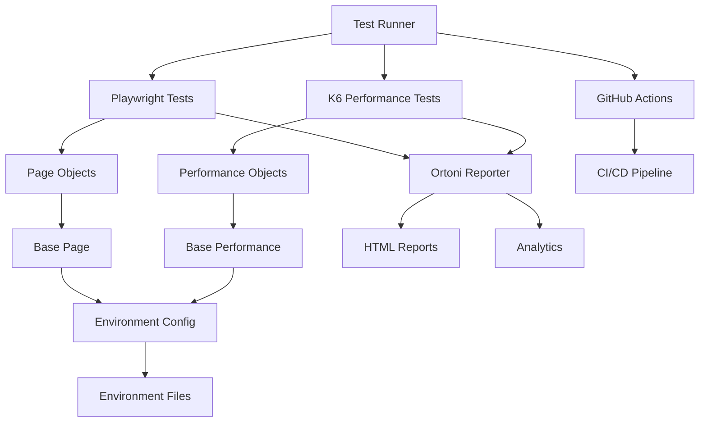

# 📚 PippaSync Test Automation Documentation

This document provides comprehensive technical documentation for the PippaSync Test Automation project.

## 📋 Table of Contents

- [Architecture Overview](#architecture-overview)
- [Technical Stack](#technical-stack)
- [Project Structure](#project-structure)
- [Configuration Management](#configuration-management)
- [Testing Framework](#testing-framework)
- [Performance Testing](#performance-testing)
- [Reporting System](#reporting-system)
- [CI/CD Pipeline](#cicd-pipeline)
- [Development Workflow](#development-workflow)
- [Troubleshooting Guide](#troubleshooting-guide)

## 🏗️ Architecture Overview

### System Architecture

```
┌─────────────────────────────────────────────────────────────┐
│                    PippaSync Test Automation                │
├─────────────────────────────────────────────────────────────┤
│  ┌─────────────────┐  ┌─────────────────┐  ┌──────────────┐ │
│  │   Playwright    │  │      K6         │  │   Ortoni    │ │
│  │   (E2E Tests)   │  │ (Performance)   │  │ (Reporting) │ │
│  └─────────────────┘  └─────────────────┘  └──────────────┘ │
├─────────────────────────────────────────────────────────────┤
│  ┌─────────────────┐  ┌─────────────────┐  ┌──────────────┐ │
│  │   Page Objects  │  │   Test Data     │  │  Utilities  │ │
│  │   (POM)         │  │   (Fixtures)    │  │  (Helpers)  │ │
│  └─────────────────┘  └─────────────────┘  └──────────────┘ │
├─────────────────────────────────────────────────────────────┤
│  ┌─────────────────┐  ┌─────────────────┐  ┌──────────────┐ │
│  │   Environment   │  │   CI/CD         │  │   Reports   │ │
│  │   Management    │  │   Pipeline      │  │   & Analytics│ │
│  └─────────────────┘  └─────────────────┘  └──────────────┘ │
└─────────────────────────────────────────────────────────────┘
```

### Component Relationships



## 🛠️ Technical Stack

### Core Technologies

| Technology | Version | Purpose |
|------------|---------|---------|
| **Node.js** | >=18 | Runtime environment |
| **npm** | >=8 | Package management |
| **Playwright** | ^1.55.0 | End-to-end testing |
| **K6** | ^0.0.0 | Performance testing |
| **Ortoni Report** | ^4.0.1 | Advanced reporting |
| **SQLite3** | ^5.1.7 | Report data storage |
| **dotenv** | ^17.2.1 | Environment management |

### Browser Support

| Browser | Engine | Status |
|---------|--------|--------|
| **Chromium** | Blink | ✅ Active |
| **Firefox** | Gecko | 🔄 Available |
| **WebKit** | WebKit | 🔄 Available |

### Environment Support

| Environment | Status | Purpose |
|-------------|--------|---------|
| **Development** | ✅ Active | Local development |
| **Staging** | ✅ Active | Pre-production testing |
| **Production** | ✅ Active | Live environment testing |

## 📁 Project Structure

### Directory Layout

```
playwright-with-k6/
├── .github/                    # GitHub Actions workflows
│   └── workflows/
│       └── playwright-with-k6.yml
├── env/                       # Environment configurations
│   ├── .env.dev
│   ├── .env.stage
│   └── .env.prod
├── fixtures/                   # Test data files
│   ├── dev.json
│   ├── stage.json
│   └── prod.json
├── k6-results/                # K6 performance test results
│   ├── summary.html
│   └── summary.json
├── ortoni-report/             # Ortoni analytics reports
│   ├── ortoni-report.html
│   └── ortoni-data/
├── pages/                     # Page Object Model
│   ├── api/
│   ├── auth-services/
│   ├── performance/
│   ├── base.page.js
│   └── index.js
├── tests/                     # Test files
│   ├── api/
│   ├── e2e/
│   └── perfromance/
├── utils/                     # Utility functions
│   ├── env.js
│   └── fixture-loader.js
├── playwright.config.js       # Playwright configuration
├── package.json              # Project dependencies
└── README.md                 # Project documentation
```

### File Naming Conventions

| Type | Pattern | Example |
|------|---------|---------|
| **Page Objects** | `*.page.js` | `signIn.page.js` |
| **Test Files** | `*.spec.js` | `signIn.spec.js` |
| **Performance Tests** | `*.k6.js` | `auth.k6.js` |
| **API Tests** | `*.api.js` | `auth.api.js` |
| **Configuration** | `*.config.js` | `playwright.config.js` |
| **Utilities** | `*.js` | `env.js` |

## ⚙️ Configuration Management

### Environment Configuration

#### Environment Variables

| Variable | Description | Example |
|----------|-------------|---------|
| `NODE_ENV` | Environment selector | `dev`, `stage`, `prod` |
| `BASE_URL` | Application base URL | `https://app.example.com` |
| `API_URL` | API endpoint URL | `https://api.example.com` |
| `EMAIL` | Valid test email | `test@example.com` |
| `PASSWORD` | Valid test password | `password123` |
| `INVALID_EMAIL` | Invalid test email | `invalid@example.com` |
| `INVALID_PASSWORD` | Invalid test password | `wrongpass` |

#### Environment Files Structure

```bash
env/
├── .env.dev          # Development environment
├── .env.stage        # Staging environment
└── .env.prod         # Production environment
```

#### Environment Loading Process

1. **Runtime Detection**: `NODE_ENV` environment variable
2. **File Selection**: `env/.env.${NODE_ENV}`
3. **Variable Loading**: `dotenv` package
4. **Export**: `utils/env.js` module

### Playwright Configuration

#### Key Configuration Options

```javascript
// playwright.config.js
module.exports = defineConfig({
  testDir: "./tests",                    // Test directory
  fullyParallel: true,                   // Parallel execution
  forbidOnly: !!process.env.CI,          // CI restrictions
  retries: process.env.CI ? 2 : 0,       // Retry logic
  workers: process.env.CI ? 1 : undefined, // Worker count
  reporter: [["ortoni-report", config]], // Reporting
  use: {
    baseURL: baseUrl,                  // Base URL
    trace: "on-first-retry",            // Trace recording
  },
  projects: [                            // Browser projects
    { name: "chromium", use: { browserName: "chromium" } }
  ]
});
```

### K6 Configuration

#### Performance Test Options

```javascript
// K6 test configuration
export const options = {
  stages: [
    { duration: '30s', target: 5 },   // Ramp up
    { duration: '1m', target: 5 },   // Sustained load
    { duration: '30s', target: 0 },  // Ramp down
  ],
  thresholds: {
    http_req_duration: ['p(95)<1300'], // Performance thresholds
    login_duration: ['p(95)<1300'],
    failed_requests: ['rate<0.3'],
  }
};
```

## 🧪 Testing Framework

### Page Object Model (POM)

#### Base Page Structure

```javascript
// pages/base.page.js
class BasePage {
  constructor(page) {
    this.page = page;
  }

  async navigateTo(url) {
    await this.page.goto(url);
  }
}
```

#### Feature Page Structure

```javascript
// pages/auth-services/signIn.page.js
class SignInPage extends BasePage {
  constructor(page) {
    super(page);
  }

  // Locators
  emailInput = 'input[name="email"]';
  passwordInput = 'input[name="password"]';
  signInButton = 'button:has-text("Sign In")';

  // Actions
  async validsignIn() {
    await this.navigate();
    await this.page.fill(this.emailInput, validemail);
    await this.page.fill(this.passwordInput, validpassword);
    await this.page.click(this.signInButton);
    await expect(this.page).toHaveURL(baseUrl);
  }
}
```

### Test Organization

#### Test File Structure

```javascript
// tests/e2e/auth-services/signIn.spec.js
const { test, expect } = require('@playwright/test');
const { SignInPage } = require('../../../pages');

test.describe('Sign In', () => {
  test('should sign in successfully', async ({ page }) => {
    const signInPage = new SignInPage(page);
    await signInPage.validsignIn();
  });
});
```

#### Test Categories

| Category | Location | Purpose |
|----------|---------|---------|
| **E2E Tests** | `tests/e2e/` | User journey testing |
| **API Tests** | `tests/api/` | Backend API testing |
| **Performance Tests** | `tests/perfromance/` | Load and performance testing |

### Test Data Management

#### Fixture Files

```json
// fixtures/dev.json
{
  "users": [
    {
      "email": "admin@admin.com",
      "password": "12345678"
    }
  ]
}
```

#### Data Loading

```javascript
// Load environment-specific data
const env = process.env.NODE_ENV || "dev";
const data = require(`../fixtures/${env}.json`);
```

## ⚡ Performance Testing

### K6 Performance Framework

#### Base Performance Class

```javascript
// pages/performance/base.perf.js
export class BasePerformance {
  constructor(http, env) {
    this.http = http;
    this.env = env;
  }

  async makeRequest(url, options = {}) {
    return this.http.request(url, options);
  }
}
```

#### Performance Test Implementation

```javascript
// tests/perfromance/auth.k6.js
import { AuthPerformance } from '../../pages/performance/auth.perf.js';

export default function() {
  const authPage = new AuthPerformance(http, env);
  // Performance test implementation
}
```

### Performance Metrics

#### Custom Metrics

| Metric | Type | Description |
|--------|------|-------------|
| `login_duration` | Trend | Login response time |
| `successful_logins` | Counter | Successful login count |
| `failed_requests` | Rate | Request failure rate |

#### Thresholds

| Threshold | Value | Description |
|-----------|-------|-------------|
| `http_req_duration` | p(95)<1300ms | 95% of requests under 1.3s |
| `login_duration` | p(95)<1300ms | Login performance |
| `failed_requests` | rate<0.3 | Less than 30% failure rate |

## 📊 Reporting System

### Ortoni Reports

#### Report Configuration

```javascript
// Ortoni report configuration
const ortoniConfig = {
  title: "PippaSync Test Report",
  port: 9324,
  projectName: "PippaSync",
  testType: "End-to-End Testing",
  authorName: "Raihan Khan",
  showProject: true,
  base64Image: false,
  stdIO: false
};
```

#### Report Features

- **Interactive Dashboard**: Rich HTML interface
- **Test Analytics**: Detailed test metrics
- **Trace Analysis**: Step-by-step execution
- **Screenshot Capture**: Visual test evidence
- **Performance Metrics**: K6 integration

### Report Types

| Report Type | Location | Purpose |
|-------------|----------|---------|
| **Ortoni Report** | `ortoni-report/` | Advanced analytics |
| **Playwright Report** | `playwright-report/` | Standard test results |
| **K6 Report** | `k6-results/` | Performance metrics |

## 🔄 CI/CD Pipeline

### GitHub Actions Workflow

#### Workflow Structure

```yaml
# .github/workflows/playwright-with-k6.yml
name: Playwright and K6 Tests

on:
  push:
    branches: [main, master]
  pull_request:
    branches: [main, master]
  workflow_dispatch:

jobs:
  playwright-tests:
    runs-on: ubuntu-latest
    steps:
      - uses: actions/checkout@v3
      - name: Setup Node.js
        uses: actions/setup-node@v3
        with:
          node-version: 18
      - name: Install dependencies
        run: npm ci
      - name: Install Playwright browsers
        run: npx playwright install --with-deps
      - name: Run Playwright tests
        run: npm test
        env:
          CI: true
```

#### Pipeline Jobs

1. **Playwright Tests**
   - Node.js setup
   - Dependency installation
   - Browser installation
   - Test execution
   - Report generation

2. **K6 Performance Tests**
   - K6 installation
   - Performance test execution
   - Results collection

3. **Report Publishing**
   - Report aggregation
   - GitHub Pages deployment
   - Artifact retention

### CI/CD Features

- **Multi-Environment Support**: Dev, Stage, Prod
- **Automated Testing**: Playwright + K6
- **Report Generation**: Ortoni + Playwright + K6
- **Artifact Management**: Reports and traces
- **GitHub Pages**: Public report hosting

## 🛠️ Development Workflow

### Local Development

#### Setup Process

1. **Clone Repository**
   ```bash
   git clone <repository-url>
   cd playwright-with-k6
   ```

2. **Install Dependencies**
   ```bash
   npm install
   npx playwright install
   ```

3. **Environment Configuration**
   ```bash
   cp env/.env.example env/.env.dev
   # Edit with your credentials
   ```

4. **Run Tests**
   ```bash
   npm test
   npm run k6
   ```

### Development Commands

| Command | Purpose |
|---------|---------|
| `npm test` | Run all Playwright tests |
| `npm run test:headed` | Run tests with browser UI |
| `npm run test:ui` | Interactive test mode |
| `npm run test:debug` | Debug mode |
| `npm run k6` | Run performance tests |
| `npm run test:all` | Run all tests |

### Code Quality

#### Linting and Formatting

```bash
# Lint code
npm run lint

# Format code
npm run format

# Clean artifacts
npm run clean
```

#### Testing Standards

- **Test Coverage**: All new features require tests
- **Code Quality**: Follow ESLint rules
- **Documentation**: Update docs for new features
- **Performance**: No regression in K6 tests

## 🔧 Troubleshooting Guide

### Common Issues

#### Playwright Issues

| Issue | Solution |
|-------|----------|
| **Browser not found** | `npx playwright install` |
| **Permission denied** | `sudo npx playwright install` |
| **Tests failing** | Check selectors and environment |

#### K6 Issues

| Issue | Solution |
|-------|----------|
| **K6 not found** | Install K6 manually |
| **Performance issues** | Check thresholds and stages |
| **Memory issues** | Reduce VU count |

#### Environment Issues

| Issue | Solution |
|-------|----------|
| **Environment not loaded** | Check `NODE_ENV` variable |
| **Missing variables** | Verify `.env` files |
| **Wrong environment** | Check environment selection |

### Debug Commands

```bash
# Debug Playwright
PWDEBUG=1 npx playwright test --headed

# Debug K6
k6 run --http-debug tests/perfromance/auth.k6.js

# Check environment
node -e "console.log(require('./utils/env'))"

# Verify dependencies
npm list
```

### Performance Optimization

#### Playwright Optimization

- **Parallel Execution**: Use `fullyParallel: true`
- **Worker Count**: Optimize based on CPU cores
- **Browser Selection**: Use Chromium for speed
- **Retry Logic**: Configure appropriate retries

#### K6 Optimization

- **VU Count**: Start with low VU count
- **Duration**: Short test durations initially
- **Thresholds**: Set realistic performance targets
- **Stages**: Use gradual ramp-up patterns

---

## 📞 Support and Resources

### Documentation Links

- [Playwright Documentation](https://playwright.dev/)
- [K6 Documentation](https://k6.io/docs/)
- [Ortoni Report Documentation](https://github.com/ortoni-io/ortoni-report)
- [GitHub Actions Documentation](https://docs.github.com/en/actions)

### Community Resources

- [Playwright Community](https://playwright.dev/community)
- [K6 Community](https://community.k6.io/)
- [GitHub Discussions](https://github.com/your-repo/discussions)

---

**Last Updated:** December 19, 2024  
**Version:** 1.0.0  
**Maintainer:** Raihan Khan
